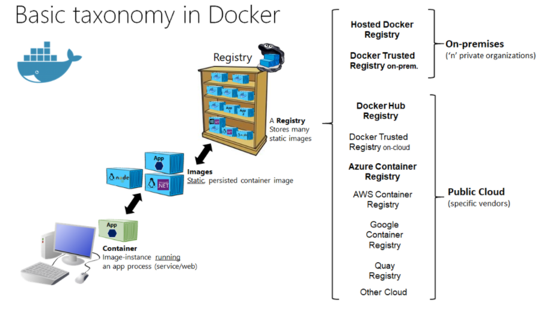

# 3. Docker에서 원하는 이미지 찾기

<br/>

## 3.1 Docker Registry  

</img>  
[그림 출처]( https://github.com/dotnet-architecture/eShopModernizing/wiki/03.-Publishing-your-Windows-Container-images-into-a-Docker-Registry)

> Docker Registry에는 사용자가 사용할 수 있도록 데이터베이스를 통해 Image를 제공해주고 있다.  
누구나 이미지를 만들어 Push할 수 있으며 푸시된 이미지는 다른 사람들에게 공유 가능하다.

<b>Docker Registry : </b>일종의 Image 파일 보관소  
<b>Images : </b>Static한 상태로써 실행이 될 수 없다.  
<b>Container : </b>Image를 실행시키기 위해 Container로 바꿔줘야 한다.  


<br/>

## 3.2 Docker Public Registry 검색 및 확인
[Docker hub]([https://hub.docker.com/](https://hub.docker.com/))에서 어떤 Image들이 있는지 확인할 수 있다.  

- <b>3.2.1 Docker 명령어로 검색</b>  
    tomcat image을 찾아보자

    ```
    $ sudo docker search tomcat
    ```

    <br/>

- <b>3.2.2 Docker 이미지 다운로드하기</b>  

    ```
    $ sudo docker pull tomcat
    Using default tag: latest
    latest: Pulling from library/tomcat
    8bf9c589d5f9: Pull complete 
    4c70e46d8b5f: Pull complete 
    ea848ad42f0d: Pull complete 
    ...
    docker.io/library/tomcat:latest
    ```

    <br/>

- <b>3.2.3 로컬 시스템에 있는 Docker 이미지 확인하기</b>  

    ```
    $ sudo docker images
    REPOSITORY  TAG      IMAGE ID      CREATED      SIZE  
    tomcat     latest  0ce438e89a29   2 days ago    667MB
    ```

    <br/>

<br/>

[뒤로가기](/Docker/README.md)  

<br/>

---

## References

[재즐보프](https://www.youtube.com/watch?v=OrK3Z1CimuU&list=PLnIaYcDMsSczk-byS2iCDmQCfVU_KHWDk&index=4&ab_channel=%EC%9E%AC%EC%A6%90%EB%B3%B4%ED%94%84)  
