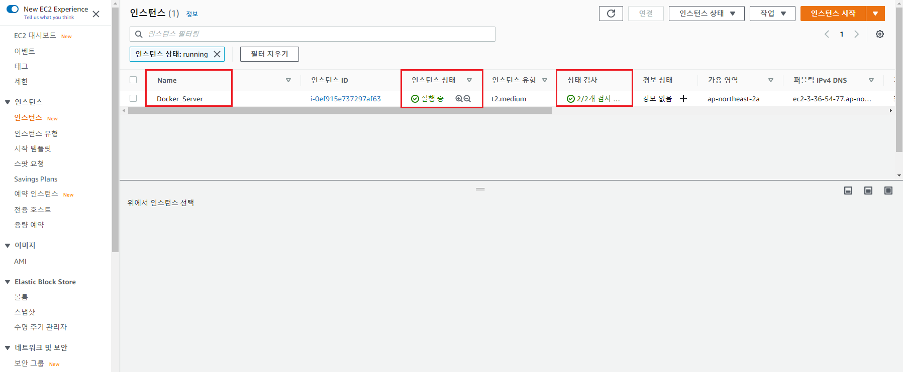
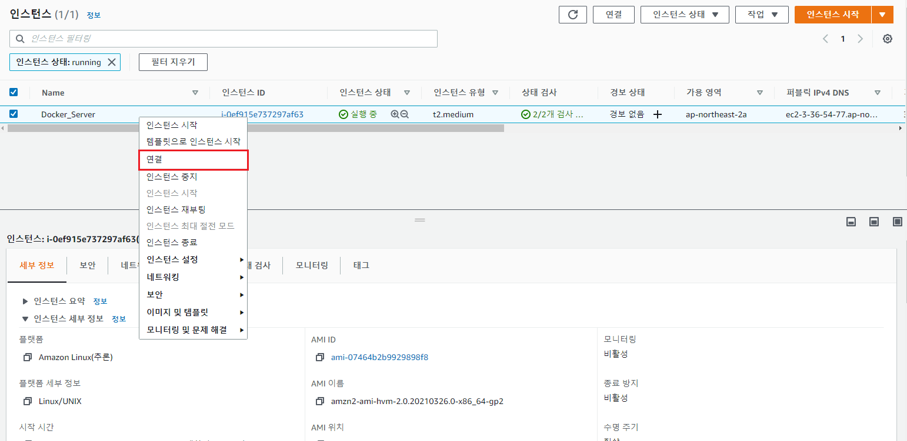
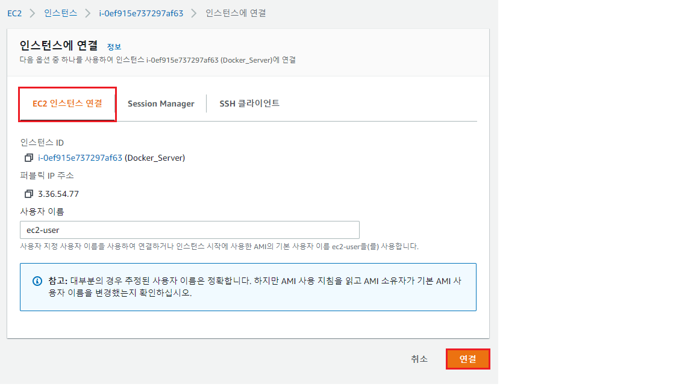
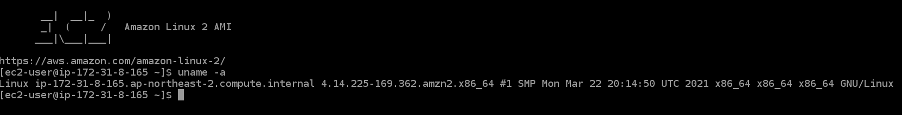
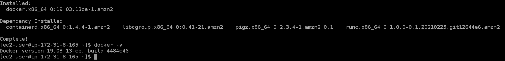

# 2. Docker 설치하기 with AWS  
<br/>

클라우드 환경이 아닌 On-Premise 환경에서 설치하려면 다음의 경로로 설치하면 된다.  

Virtual Box를 설치하고 다음의 파일을 [다운로드](https://drive.google.com/file/d/1JMs6Iw1_Ke7lz4g5tNqNE6ybA57CPVsD/view) 받는다.  

<details>
<summary>Virtual Box (Click!)</summary>
    </br>
    <span>Windows라면 Windows Host Version을 </span>
    <a markdown="1" href="https://www.virtualbox.org/wiki/Downloads">다운로드</a>
    <span> 받는다.</span>
</details>

</br>

> 최소 필요 사양  
> CPU 4개 이상, RAM 8GB 이상
> - ID:PW// server1 : test1234
> - 관리자 전환: sudo -i  

</br></br></br>

### 2.1 AWS 환경에서 Docker 설치하기

1. EC2 인스턴스 생성  
    
    <b>1-1 단계 1: Amazon Machine Image(AMI) 선택</b>  
    </img>
    - <b>Amazon Linux 2 AMI</b> 선택  
    </br>

    <b>1-2 단계 2: 인스턴스 유형 선택</b>  
    </img>
    - VM에서 설정한 사양과 비슷한 <b>t2.large</b> 모델 선택  
    </br>  

    <b>1-3 단계 3: 인스턴스 세부 정보 구성</b>    
    </img>  
    - 퍼블릭 IP 자동 할당 <b>활성화</b> 선택
    </br>  
 
    <b>1-4 단계 4: 스토리지 추가</b>  
    </img>  
    - 스토리지는 Default 값으로 선택
    - 다음: 태그 추가 클릭  
    </br>  

    <b>1-5 단계 5: 태그 추가 </b>  
    </img>  
    - Key : Name  
    - Value : Docker_Server (원하는대로 설정 가능) 
    - 다음: 보안 그룹 구성 클릭  
    </br>

    <b>1-6 단계 6: 보안 그룹 구성</b>  
    </img>  
    - 새 보안 그룹 생성
    - 보안 그룹 이름 : <b>DOCKER_SG</b> (원하는대로 설정 가능)  
    - 검토 및 시작 클릭  
    </br>  

    <b>1-7 단계 7: 인스턴스 시작 검토</b>  
    </img>  
    - 시작하기 클릭  
    - <b>.pem key가 없다면 새로운 pem key 생성</b>  
    </br>     

---

</br>
 
2. EC2 인스턴스 접속  
    
    <b>2-1 EC2 인스턴스 상태 확인 </b>  
    </img>  
    - 인스턴스 상태, 상태 검사가 사진과 같은 모습인지 확인  
    - 그렇지 않다면 조금 더 기다린다  
    </br>  

    <b>2-2 EC2 인스턴스 연결(1)</b>  
    </img>  
    - 우클릭 후 <b>연결</b> 클릭
    </br>  

    <b>2-3 EC2 인스턴스 연결(2)</b>  
    </img>  
    </br>  

    <b>2-4 uname -a 명령어 확인</b>  
    </img>
     ```
    $ uname -a
    위 명령어로 올바른 주소인지 확인한다.
    ```
    </br>

---

</br>

3. Docker 환경 구축  

    <b>3-1 Docker 설치하기</b>  
    ```
    $ sudo yum -y upgrade
    $ sudo yum -y install docker
    $ sudo docker -v
    Docker version 19.03.13-ce, build 4484c46
    ```
    </img>  
    Docker가 정상적으로 설치되었음을 확인할 수 있다.  

    </br>

    <b>3-2 Docker 시작하기</b>  
    ```
    $ sudo service docker start
    ```

    </br>

    <b>3-3 그룹에 사용자 추가</b>  
    ```
    $ sudo usermod -aG docker ec2-user
    ```

    </br>

    <b>3-4 Docker-compose 설치</b>  
    ```
    $ sudo curl -L https://github.com/docker/compose/releases/download/1.25.0-rc2/docker-compose-`uname -s`-`uname -m` -o /usr/local/bin/docker-compose
    ```
    
    </br>

    <b>Docker-compose의 역할?</b>  
    
    만약 똑같은 역할을 하는 여러 개의 컨테이너를 관리한다면 같은 내용의 명령어를 반복해서 입력해야 한다.  
    하지만 docker compose를 이용하면 명령어 한 번으로 컨테이너 실행이 가능해진다.  
    보통 docker compose는 docker-compose.yaml 파일로 관리한다.  

    </br>

    > <b>Docker Compose & Kubernetes</b></br>  
     Docker compose의 기능을 보면 Kubernetes와 비슷해 조금은 혼란스러울 수 있다.  
    <b>.yaml 파일에 정의된 내용으로 컨테이너를 만든다</b>는 기능적 공통점을 갖기 때문이다.  
    
    둘의 차이는..  
    <b>1. Kubernetes</b>  
    - 쿠버네티스 클러스터 내에서 컨테이너를 생성하고 관리하는 컨테이너 관리 도구  
    - yaml 파일에 정의된 내용을 바탕으로 쿠버네티스 클러스터 내에서 쿠버네티스 오브젝트를 만들고 컨트롤러를 만든다.  

    <b>2. Docker Compose</b>  
    - yaml 파일에 정의된 내용을 바탕으로 Host 컴퓨터 내에 컨테이너를 만든다.  

    </br>

    <b>3-5 실행권한 추가하기</b>  
    ```
    $ sudo chmod +x /usr/local/bin/docker-compose
    ```
    설치 후에 chmod 명령어를 사용하여 디렉토리에 excute 권한을 추가한다.  

    </br>

    <b>3-6 설치 확인하기</b>  
    ```
    $ sudo docker-compose -v
    docker-compose version 1.25.0-rc2, build 661ac20e
    ```
    


</br>


---


4. Docker 명령어 확인


</br></br></br>

## References

[재즐보프](https://www.youtube.com/watch?v=OrK3Z1CimuU&list=PLnIaYcDMsSczk-byS2iCDmQCfVU_KHWDk&index=4&ab_channel=%EC%9E%AC%EC%A6%90%EB%B3%B4%ED%94%84)  

