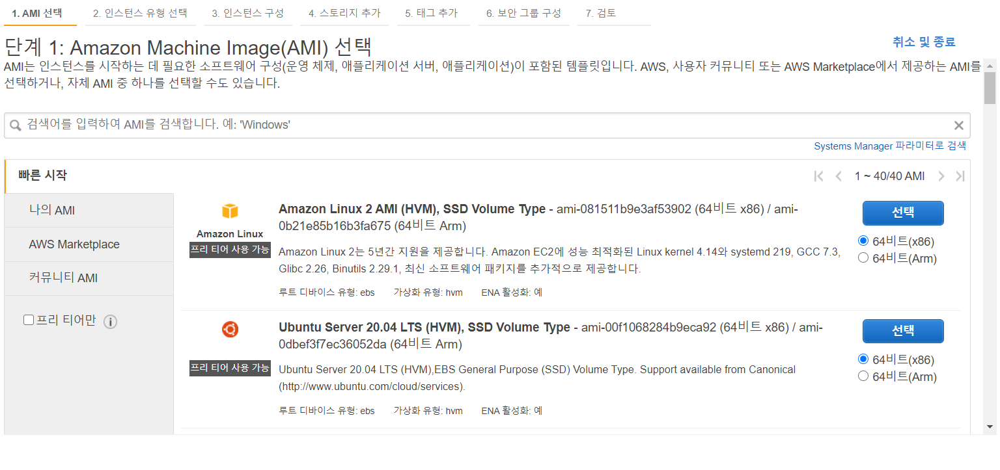
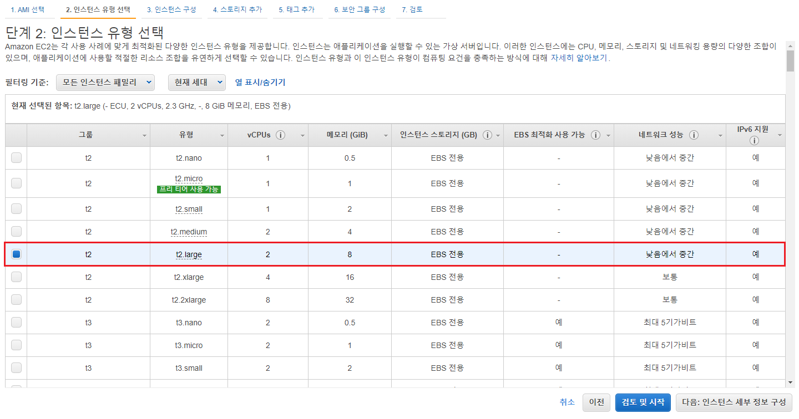
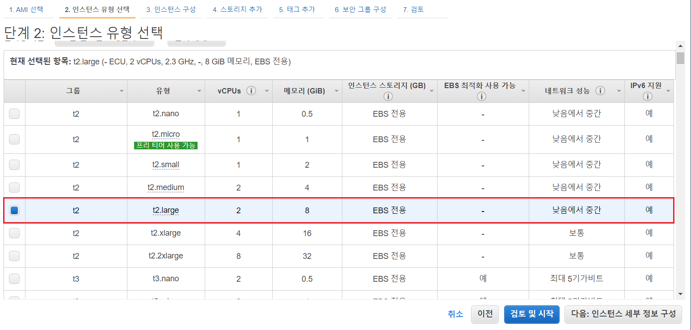
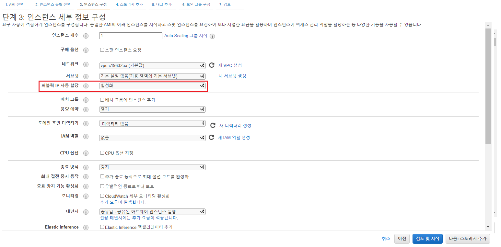
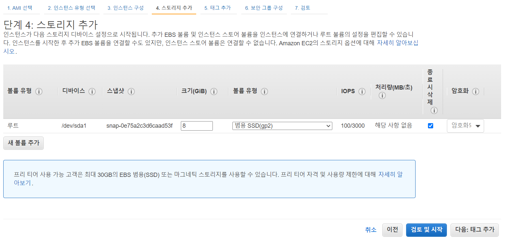
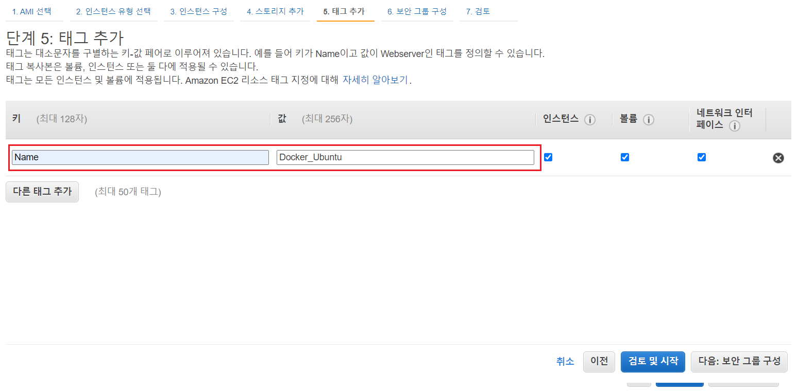
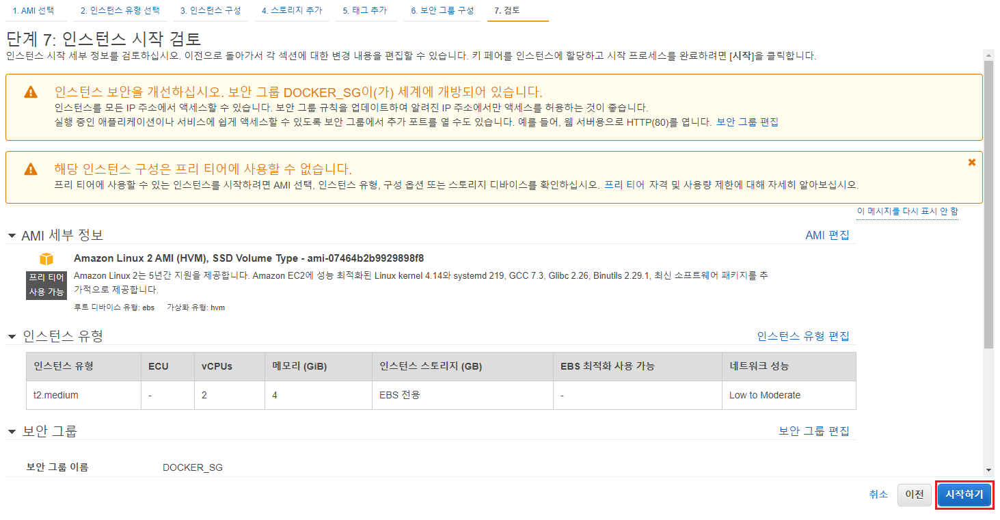

# 2. Install Docker  
 

클라우드 환경이 아닌 On-Premise 환경에서 설치하려면 다음의 경로로 설치하면 된다.  

Virtual Box를 설치하고 다음의 파일을 [다운로드](https://drive.google.com/file/d/1JMs6Iw1_Ke7lz4g5tNqNE6ybA57CPVsD/view) 받는다.  

Virtual Box (Click!)

     
    Windows라면 Windows Host Version을 
    <a markdown="1" href="https://www.virtualbox.org/wiki/Downloads">다운로드</a>
     받는다.

 

> 최소 필요 사양  
> CPU 4개 이상, RAM 8GB 이상
> - ID:PW// server1 : test1234
> - 관리자 전환: sudo -i  

   

### 2.1 AWS 환경에서 Docker 설치하기

1. EC2 인스턴스 생성  
    1-1 단계 1: Amazon Machine Image(AMI) 선택  
    </img>
    - <b>Amazon Linux 2 AMI</b> 선택  
     

    1-2 단계 2: 인스턴스 유형 선택  
    </img>
    - VM에서 설정한 사양과 비슷한 <b>t2.large</b> 모델 선택  
       

    1-3 단계 3: 인스턴스 세부 정보 구성    
    </img>  
    - 퍼블릭 IP 자동 할당 <b>활성화</b> 선택
       
 
    1-4 단계 4: 스토리지 추가  
    </img>  
    - 스토리지는 Default 값으로 선택
    - 다음: 태그 추가 클릭
       

    1-5 단계 5: 태그 추가  
    </img>
    - Key : Name  
    - Value : Docker_Server (원하는대로 설정 가능) 
    - 다음: 보안 그룹 구성 클릭  
     

    1-6 단계 6: 보안 그룹 구성  
    </img>  
    - 새 보안 그룹 생성
    - 보안 그룹 이름 : <b>DOCKER_SG</b> (원하는대로 설정 가능)  
    - 검토 및 시작 클릭  
       

    1-7 단계 7: 인스턴스 시작 검토  
    </img>  
    - 시작하기 클릭  
       

2. EC2 인스턴스 접속

3. Docker 환경 구축

4. Docker 명령어 확인

   

## References

[재즐보프](https://www.youtube.com/watch?v=OrK3Z1CimuU&list=PLnIaYcDMsSczk-byS2iCDmQCfVU_KHWDk&index=4&ab_channel=%EC%9E%AC%EC%A6%90%EB%B3%B4%ED%94%84)  

