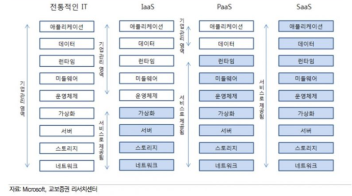

# 1. Docker Intro  
<br/>

## 1-1. Docker는 왜 필요할까?
 
 Docker는 *컨테이너 기술을 지원하는 다양한 프로젝트 중 하나이다. 컨테이너 기술을 과거에도 존재했으나 Docker를 통해 많이 알려지게 되었다.

기존의 컨테이너 기술은 사용자의 OS 환경에 따라 그 내용이나 명령어의 내용 등이 상이했다. 하지만 Docker를 이용한다면 환경의 제약을 받지 않고 원하는 애플리케이션을 실행할 수 있다.
컨테이너는 주로 대규모 기업, 대규모 프로젝트에서 사용된다. 요즘은 프로젝트를 시작할 때 아예 컨테이너 기반으로 시작하기도 한다.  

개발팀 vs. 운영팀  
개발팀과 운영팀은 적대적이라고 바라 볼 수도 있다. 서로의 성향이 매우 다르기 때문이다.  

- 개발팀은 매번 새로운 것을 개발하는데 반면, 운영팀은 이러한 것들을 안정적으로 운영하는 것이 최우선 목표이다.
- 개발팀은 엄청 많은 팀들이 존재할 수 있는데 운영팀은 이 모든 팀들을 수용하기 힘들다.  

그래서 보통 가상환경이라는 것을 사용한다. 가상환경을 만들어놓으면 운영팀은 운영하기가 매우 수월해진다. 
- 기존의 가상환경은 Host OS 위에 추상화된 HW와 Guest OS를 올렸는데, 이렇게 되면 매우 무겁다. 
- 이 부분을 컨테이너화하는 아이디어가 나오게 된 것이다.  
 
<br/><br/>

## 1-2. Docker

Docker는 컨테이너 기술의 사실상 표준이 되었다. Linux, Windows, Mac OS 등 다양한 운영체제에서 사용 가능하며 애플리케이션에 국한되지 않고 의존 및 파일 시스템까지 패키징하여 빌드, 배포 실행을 단순화하였다.

Linux의 Namespace와 cgroups와 같은 커널 기능을 사용하여 가상화가 가능하다.
```
* Linux Namespace?
Linux Namespace는 프로세스를 실행할 때 시스템의 리소스를 분리해 실행할 수 있도록 도와주는 기능이다.
한 시스템의 프로세스들은 기본적으로 시스템의 리소스를 공유해서 실행되는데 이를 단일 Linux Namespace라 볼 수 있다.
Linux에서는 1번 프로세스(init)에 할당돼 있는 Namespace들을 자식 프로세스들이 모두 공유해서 사용하는 구조로 이루어져있다.
```

Docker는 다양한 클라우드 서비스 모델과 같이 사용 가능하다. 
```
이미지 : 필요한 프로그램과 라이브러리, 소스를 설치한 뒤 만든 하나의 파일
컨테이너 : 이미지를 격리하여 독립된 공간에서 실행한 가상 환경
```
</img><br/>
<br/><br/>

## 1-3. Container
> 컨테이너란 (Container)?  
컨테이너는 애플리케이션을 실제 구동 환경으로부터 추상화할 수 있는 논리 패키징 매커니즘을 제공한다.  
즉, 호스트 OS에서 구동되며 하드웨어에서 가상으로 액세스하는 Linux, Windows 등의 게스트 OS를 의미한다.  

> 더 쉽게 말하자면, 호스트 OS위에 컨테이너 관리 소프트웨어를 만들고 그 위에 컨테이너를 올린다.  
이 컨테이너는 어플리케이션을 작동시키기 위해 필요한 라이브러리, 어플리케이션 등을 모아 별도의 서버처럼 사용 가능하게 만든 것이다.

기존의 VM 사용방식처럼 Hypervisor 위에 올려 사용한다면 동일 시스템에서 실행하는 소프트웨어의 컴포넌트가 충돌하거나 다양한 종속성을 갖는다.

컨테이너는 가상머신을 사용해 각 Micro Service를 격리(isolate)하는 기술이다. 가상머신처럼 하드웨어를 전부 구현하는 것은 아니기 때문에 매우 빠른 실행이 가능하다.
<br/><br/>

## 1-4. Container vs. Virtual Machine 

> 그렇다면 Container와 VM의 성능 차이는 얼마나 날까?


<br/><br/>

## 1-5. 컨테이너를 격리하는 기술
<br/>

* Linux Namespace : 각 프로세스가 파일 시스템 마운트, 네트워크, 유저(uid), 호스트 네임(uts) 등에 대해 시스템에 독립 뷰를 제공한다.  
    * 파일이나 네트워크 인터페이스를 가상화해서 본인만의 것을 가질 수 있다.  

* Linux Control Group(cgroup) : 프로세스로 소비할 수 있는 리소스 양을 제한한다.  
(리소스 양 = CPU, Memory, I/O, 네트워크 대역대, Device Node 등..)  
    * cgroup은 기본적으로 Linux에 탑재된 기능이다. 따라서 Docker는 Linux에서 가상화를 이뤄준다.  
    * Docker가 만약 Windows에 설치된다면? Hyber Visor를 사용한다.

<br/><br/>

## 1-6. Docker의 한계

- Docker를 사용해 관리하더라도 쉽지 않은 형태 배포 및 컨테이너 배치 전략 Scale-up, Scale-out이 쉽지 않다.  
- Docker를 실시간으로 글로벌한 트래픽을 감당할 수 있게 사용하려면 멀티 호스트에 Docker를 사용해야 한다.  
- 그렇다면 여러 대의 서버에서 컨테이너를 관리한다면 네트워크 상으로도 쉽지 않을 것이다.  
- 이를 위해 많은 오케스트레이션 제품들이 나오게 됐다. 그 중 하나가 바로 Kubernetes이다.
```
Scale-up : 기존의 서버에서 더욱 고성능의 서버로 변경하는 것

> 단점
- 스토리지 컨트롤러의 확장성 한계의 문제
- 성능 그리고 용량 확장 제한에 다다른 경우, 
  새 시스템을 추가해야되는데 이때 발생하는 마이그레이션 비용


Scale-out: 기존의 서버와 같은 사양 또는 비슷한 사양의 서버 대수를 증가시키는 방법으로 처리 능력을 향샹시키는 것

> 단점
- 병렬 컴퓨팅의 설계 및 구현
- 기본적으로 직렬화 되어야 할 부분이 존재
- 대역폭, 동기화 문제
- 코어가 늘어남에 따라 마냥 성능이 증가 X
- 코어 증가에 따라 대역폭은 증가해 지연 발생 가능성 존재
```


<br/><br/><br/>
---------------------------------------

## References

[재즐보프](http://blog.naver.com/PostView.nhn?blogId=isc0304&logNo=221840483579&categoryNo=99&parentCategoryNo=0&viewDate=&currentPage=1&postListTopCurrentPage=1&from=postList&userTopListOpen=true&userTopListCount=30&userTopListManageOpen=false&userTopListCurrentPage=1)  
[Scale-in/out 출처: 토마의 개발노트](https://toma0912.tistory.com/87)  
[Container - Google Cloud](https://cloud.google.com/containers?hl=ko)  