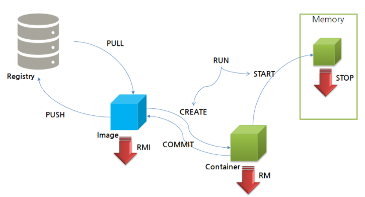

# 4. Docker Life cycle 이해와 명령어 실습  

<br/>

## 4.1 Docker Life cycle 이해하기
</img>  


<br/><br/>

## 4.2 Docker Life cycle 명령어 실습  

<b>4.2.1 Docker 이미지 다운로드와 삭제</b>  
```
$ sudo docker pull consol/tomcat-7.0
Using default tag: latest   
...
consol/tomcat-7.0:latest
docker.io/consol/tomcat-7.0:latest

$ sudo docker rmi consol/tomcat-7.0
```

<br/>

<b>4.2.2 Tomcat 컨테이너 생성 및 실행</b>  
```
$ sudo docker run -d --name <사용자지정 Container Name> tomcat
```
run 명령은 create와 start가 포함되어 있다. 따라서 생성과 동시에 실행이 완료된다.

<br/>


<b>4.2.3 실행중인 컨테이너 확인</b>  
```
$ sudo docker ps

CONTAINER ID   IMAGE     COMMAND             CREATED           STATUS          PORTS      NAMES
e9ef7e6c9732   tomcat "catalina.sh run"   17 seconds ago    Up 11 seconds     8080/tcp     tmc
```

<br/>


<b>4.2.4 모든 컨테이너 확인</b>  
```
$ sudo docker ps -a
```

<br/>


<b>4.2.5 컨테이너 중지</b>  
```
$ sudo docker stop <Container ID>
```

<br/>


<b>4.2.6 컨테이너 삭제</b>  
```
$ sudo docker rm <Container ID>
```

<br/>

이미 컨테이너에 올라가 있는 이미지를 삭제하고 싶다면 컨테이너를 먼저 삭제하고 이미지를 삭제해야 한다.
